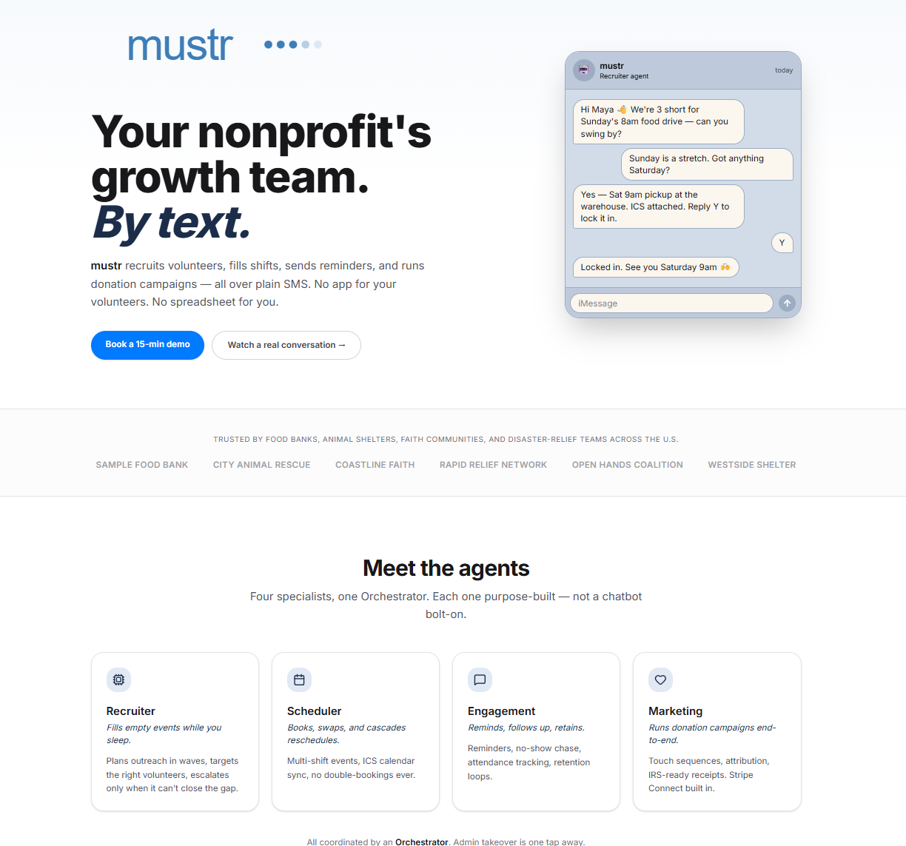

# AI-Powered Appointment Booking System

<p align="center">
  
</p>

A full-stack, multi-tenant appointment booking system with an AI-powered SMS chatbot, built for service businesses. Customers (volunteers) book appointments via natural SMS conversations, while staff manage everything through a React admin panel.

## Features

### SMS Chatbot
- Natural language booking via Twilio SMS
- 2-stage AI pre-screener (rule-based + Claude AI) with conversation context awareness
- 19-step inbound message pipeline with conversation context
- Automatic opt-in/opt-out consent management
- Context-aware screening — short replies like "yes" or "tomorrow" are evaluated against the active conversation, preventing false strikes

### Admin Panel (React)
- **Dashboard** — Today's bookings, monthly KPIs, weekly slot overview, volunteer breakdown, unreviewed suspensions, notifications
- **Bookings** — Full CRUD, reschedule, cancel, status updates, booking history timeline
- **Volunteers** — Contact management, service assignment (per-service or all-services toggle), conversation history, appointment patterns, CSV import
- **Appointment Types** — Service catalog with pricing, durations, related services
- **Availability** — Weekly schedule builder, specific date slot overrides, blocked dates, real-time slot preview
- **Reminders** — Upcoming/history views, manual trigger, cancel with reason, analytics
- **Conversations** — Per-customer SMS conversation viewer with chat-style UI
- **Suspensions** — AI-flagged review queue, lift/confirm/ban actions, manual suspend via SMS
- **Analytics** — Booking volume charts, revenue trends, consent funnel, retention metrics
- **Token Usage** — AI token consumption dashboard with drill-downs by volunteer, tool, source, model, and daily trends with cost estimates
- **SMS Test Tool** — Simulate volunteer/admin SMS conversations with searchable volunteer selector, screener integration, and tool call visibility
- **Settings** — System configuration, custom AI prompts, admin user management (owner/manager/staff roles)
- **Tenants** — Super-admin tenant dashboard for multi-tenant management
- **Announcements** — Broadcast messages to customers

### Multi-Tenant Architecture
- Row-level tenant isolation (`tenant_id` on every table)
- Per-tenant credentials (Twilio, Anthropic, Google, Resend)
- Super-admin role with cross-tenant management
- Tenant context via `X-Tenant-Id` header for super-admins

### Volunteer Service Assignment
- Per-volunteer service access control with "All Services" toggle (off by default)
- Specific service assignment via join table
- Volunteers with no services assigned cannot book — admin is notified when they try
- Admins bypass all service restrictions

### Token Usage Tracking
- Every Anthropic API call (conversations, screener, test tool) is recorded with input/output token counts
- Per-request tracking of contact, tool calls used, and model
- Dashboard with KPI summary, daily usage chart, cost estimates
- Drill-down views: by volunteer, by AI tool, by source, by model
- Recent API call log with tool details

### Backend Services
- Google Calendar integration (OAuth2, event CRUD)
- ICS calendar file generation (RFC 5545)
- Email notifications via Resend
- Recurrence pattern calculation for proactive reminders
- APScheduler background jobs (reminders, follow-ups, announcements, pattern recalculation)

## Tech Stack

### Backend
- **Python 3.12+** with **FastAPI**
- **SQLAlchemy 2.x** async ORM with **asyncpg**
- **Supabase PostgreSQL** database
- **Supabase Auth** + JWT validation (python-jose)
- **Alembic** for database migrations
- **APScheduler** for background job scheduling

### Frontend
- **React 18** with **TypeScript**
- **Vite** build tool
- **Tailwind CSS v4** + **shadcn/ui v4** (base-ui primitives)
- **TanStack Query v5** for server state management
- **Recharts** for analytics visualizations
- **React Router v7** for navigation

### External Services
- **Twilio** — SMS sending/receiving with webhook signature validation
- **Anthropic Claude** (claude-haiku-4-5) — Conversation AI engine with tool_use protocol
- **Google Calendar API** — Calendar event sync
- **Resend** — Transactional email

## Project Structure

```
booking-system/
├── backend/
│   ├── app/
│   │   ├── api/            # 15 API routers (~70+ endpoints)
│   │   ├── core/           # Config, database, dependencies, logging
│   │   ├── middleware/     # Auth, rate limiting
│   │   ├── models/         # 19 SQLAlchemy models
│   │   ├── modules/        # Screener, conversation AI, SMS pipeline, tool executor
│   │   ├── prompts/        # System prompts (screener, conversation)
│   │   ├── scheduler/      # APScheduler background jobs
│   │   ├── schemas/        # Pydantic request/response schemas
│   │   ├── services/       # Auth, booking, SMS, calendar, email, availability, token usage
│   │   └── main.py
│   ├── alembic/            # Database migrations (a001–a010)
│   ├── tests/              # 90 tests across 17 files
│   └── requirements.txt
├── frontend/
│   ├── src/
│   │   ├── components/     # Shared UI components (shadcn/ui)
│   │   ├── features/       # 14 feature modules
│   │   │   ├── analytics/
│   │   │   ├── announcements/
│   │   │   ├── appointment-types/
│   │   │   ├── availability/
│   │   │   ├── auth/
│   │   │   ├── bookings/
│   │   │   ├── conversations/
│   │   │   ├── customers/
│   │   │   ├── dashboard/
│   │   │   ├── reminders/
│   │   │   ├── settings/
│   │   │   ├── suspensions/
│   │   │   ├── tenants/
│   │   │   ├── test-tool/
│   │   │   └── token-usage/
│   │   ├── context/        # Auth context
│   │   ├── hooks/          # Shared hooks
│   │   ├── lib/            # API client, utilities
│   │   └── types/          # TypeScript type definitions
│   └── package.json
├── docs/                   # Architecture documentation
└── requirements/           # Functional & technical specs
```

## Getting Started

### Prerequisites
- Python 3.12+
- Node.js 18+
- Supabase project (PostgreSQL + Auth)
- Twilio account (for SMS)
- Anthropic API key (for AI chatbot)

### Environment file

Put a single **`.env`** at the **repository root** (`booking-system/.env`) **or** in **`backend/.env`**. If both exist, `backend/.env` overrides. Copy from `backend/.env.example` and fill in real values. Extra keys in `.env` (e.g. split Postgres vars) are ignored.

### Backend Setup

```bash
cd backend
python -m venv .venv
source .venv/bin/activate            # Linux/macOS
# Windows: .\.venv\Scripts\Activate.ps1
pip install -r requirements.txt

# Migrations (PYTHONPATH required so `app` imports resolve)
# Linux/macOS: export PYTHONPATH="$(pwd)"
# Windows PowerShell: $env:PYTHONPATH = (Get-Location).Path
alembic upgrade head

# Or Windows: .\migrate.ps1  (uses .venv Python automatically)

# Start the API
uvicorn app.main:app --reload --host 127.0.0.1 --port 8000
# Or Windows: .\run-dev.ps1
```

### Frontend Setup

```bash
cd frontend
npm install
# Optional: copy .env.example to .env — defaults to http://localhost:8000/api/v1
npm run dev
```

Open **http://127.0.0.1:5173** (or the URL Vite prints). Set `ADMIN_PANEL_URL=http://localhost:5173` in backend `.env` so CORS allows the dev origin.

### Running Tests

```bash
cd backend
python -m pytest tests/ -v
```

All 90 tests pass in under 1 second using mock-based testing (no database required).

## Environment Variables

| Variable | Description |
|----------|-------------|
| `DATABASE_URL` | PostgreSQL connection string (asyncpg) |
| `SUPABASE_URL` | Supabase project URL |
| `SUPABASE_JWT_SECRET` | JWT secret for token validation |
| `SUPABASE_SERVICE_KEY` | Supabase service role key |
| `TWILIO_ACCOUNT_SID` | Twilio account SID |
| `TWILIO_AUTH_TOKEN` | Twilio auth token |
| `TWILIO_PHONE_NUMBER` | Twilio phone number for sending SMS |
| `ANTHROPIC_API_KEY` | Anthropic API key for Claude |
| `GOOGLE_CREDENTIALS_JSON` | Google OAuth2 credentials (optional) |
| `RESEND_API_KEY` | Resend API key for email (optional) |
| `ADMIN_PANEL_URL` | Frontend URL for CORS (default: `http://localhost:5173`) |

## API Overview

The backend exposes 70+ endpoints across 15 routers:

| Router | Prefix | Description |
|--------|--------|-------------|
| Auth | `/api/v1/auth` | Login, refresh, logout |
| Dashboard | `/api/v1/dashboard` | KPIs, today's bookings, weekly slots, notifications |
| Bookings | `/api/v1/bookings` | CRUD, reschedule, cancel, history |
| Customers | `/api/v1/customers` | CRUD, service assignment, conversations, patterns, consent |
| Appointment Types | `/api/v1/appointment-types` | Service catalog management |
| Availability | `/api/v1/availability` | Schedule rules, specific dates, blocked dates, slots |
| Reminders | `/api/v1/reminders` | Upcoming, history, trigger, cancel |
| Suspensions | `/api/v1/suspensions` | List, review, lift, confirm, ban |
| Analytics | `/api/v1/analytics` | Booking, revenue, retention, consent stats |
| Token Usage | `/api/v1/token-usage` | AI token consumption analytics with drill-downs |
| Settings | `/api/v1/settings` | System configuration |
| Admin Users | `/api/v1/admin-users` | User management (owner only) |
| Tenants | `/api/v1/tenants` | Multi-tenant management (super-admin) |
| Announcements | `/api/v1/announcements` | Broadcast messages |
| Conversations | `/api/v1/conversations` | Conversation history |
| Test Conversation | `/api/v1/test-conversation` | SMS test tool |
| Webhook | `/api/v1/webhook` | Twilio SMS inbound webhook |
| Calendar ICS | `/api/v1/calendar` | ICS file endpoints |
| Health | `/health` | Health check |

## License

Private project — all rights reserved.
