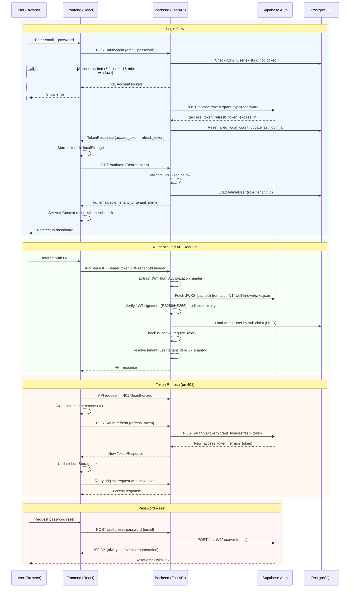
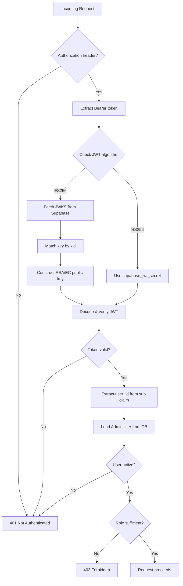
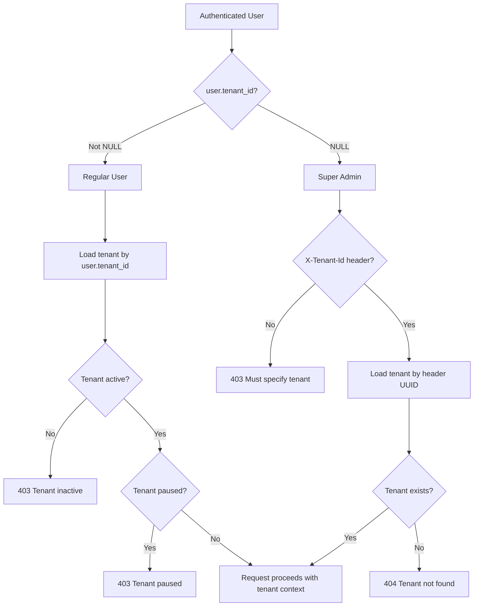
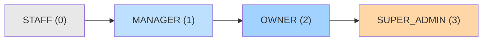
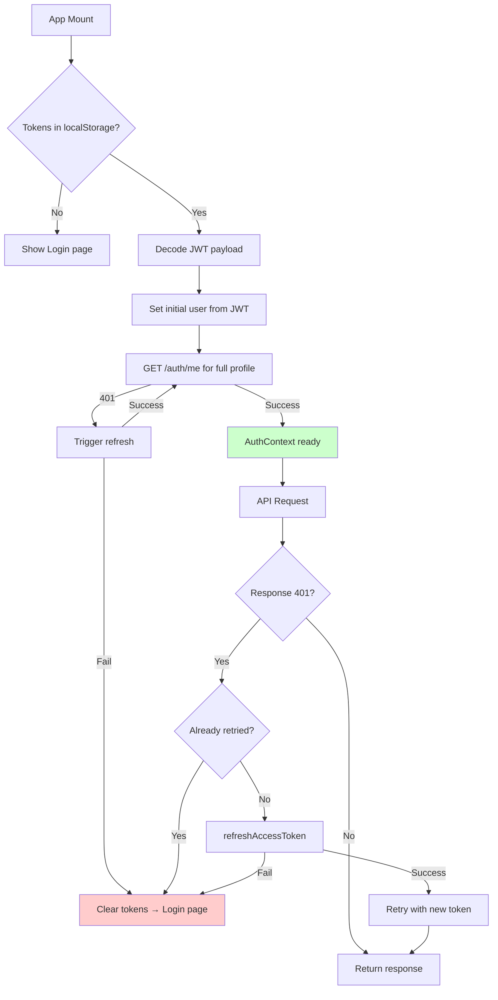

# Authentication System — Data Flow

## Overview

Stateless JWT-based auth using **Supabase Auth** as the identity provider. Application roles, tenant isolation, and session management are handled by the backend and frontend layers.

## Authentication Flow

## JWT Validation Flow

## Multi-Tenant Context Resolution

## Role Hierarchy

| Role | Scope | Capabilities |
|------|-------|-------------|
| STAFF | Own tenant | Read-only access |
| MANAGER | Own tenant | CRUD customers, bookings, settings |
| OWNER | Own tenant | All of MANAGER + manage admin users, update settings |
| SUPER_ADMIN | All tenants | All of OWNER + create/manage tenants, cross-tenant dashboard |

## Frontend Token Management

## Security Features

- **Account Lockout**: 5 failed login attempts → 15-minute lockout
- **Rate Limiting**: Auth endpoints (login, refresh, reset) are rate-limited
- **Refresh Deduplication**: Single in-flight refresh promise prevents race conditions
- **Email Enumeration Prevention**: Login errors are generic; password reset always returns 200
- **Audience Validation**: JWT `aud` must be "authenticated"
- **Tenant Isolation**: Row-level filtering by tenant_id on every query
- **Stateless Sessions**: No server-side session store; tokens valid until expiry
